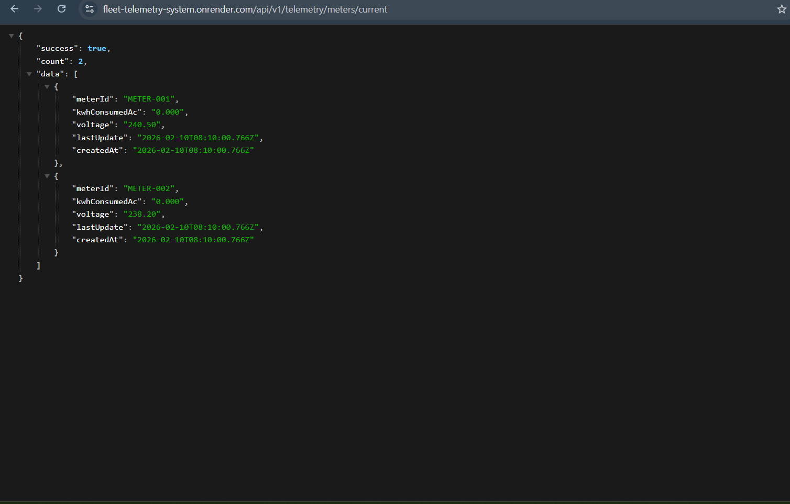

# Fleet Telemetry System
## NestJS + PostgreSQL | Real-time EV Fleet & Smart Meter Management

---

## 1. EXECUTIVE SUMMARY

This system manages 10,000+ Smart Meters and EV Fleets. Every device sends data every 60 seconds. We store it, correlate it, and provide fast analytics on power efficiency.

```
DAILY VOLUME CALCULATION:
  10,000 meters  × 1440 readings/day = 14,400,000 meter rows
  10,000 vehicles × 1440 readings/day = 14,400,000 vehicle rows
  TOTAL = 28,800,000 rows PER DAY
```

### Quick Configuration Reference

| Component | Value |
|-----------|-------|
| **Database** | PostgreSQL 16+ |
| **Database Name** | `` |
| **DB User** | `` |
| **DB Password** | `` |
| **DB Port** | `5432` |
| **Application Port** | `3000` |
| **Framework** | NestJS + TypeORM |
| **Data Retention** | Partitioned by month |

---

## 2. DOMAIN CONTEXT (Hardware Flow)

```
GRID (AC Power 240V)
     │
     ▼
┌─────────────┐
│ SMART METER │  ──── Reports: kwhConsumedAc + voltage + timestamp
│ (Grid Side) │       Measures AC power consumption from grid (billing reference)
└─────────────┘
     │
     ▼
┌─────────────┐
│ EV CHARGER  │  ──── Converts: AC → DC (heat loss occurs during conversion)
│ (Converter) │       AC to DC conversion - some power is lost as heat
└─────────────┘
     │
     ▼
┌─────────────┐
│ EV BATTERY  │  ──── Reports: kwhDeliveredDc + SoC% + batteryTemp + timestamp
│(Vehicle Side│       Measures DC energy delivered to battery, battery percentage
└─────────────┘

POWER LOSS ANALYSIS:
  AC Consumed (100 kWh) > DC Delivered (87 kWh)
  Loss = 13 kWh (heat during conversion)
  Efficiency = 87/100 = 87% ✅ NORMAL

  IF Efficiency < 85% = Hardware fault or energy leakage ⚠️
  IF Efficiency < 75% = CRITICAL - Immediate inspection required ❌
```

---

## 3. ARCHITECTURE (Hot/Cold Strategy)

### WHY TWO TABLES? (Hot/Cold Separation)

```
PROBLEM WITHOUT SEPARATION:
  Dashboard query: "What is VEHICLE-001's current battery percentage?"
  Without hot table: Scan 2 BILLION rows → 30 seconds ❌

SOLUTION WITH HOT/COLD SPLIT:
  Dashboard query: Primary key lookup on 10,000 rows → 1ms ✅
  Analytics query: Partition pruning → ~1,440 rows → 50ms ✅
```

```
INCOMING DATA (every 60 seconds)
         │
         ▼
┌─────────────────────────────────────────────┐
│           DUAL-WRITE TRANSACTION             │
│  (Both writes happen atomically -            │
│   either both succeed or both fail)          │
├──────────────────┬──────────────────────────┤
│   HOT PATH       │   COLD PATH              │
│   (UPSERT)       │   (INSERT)               │
│                  │                          │
│ meter_current_   │ meter_telemetry_         │
│   state          │   history                │
│ ─ 10K rows       │ ─ Billions of rows       │
│ ─ Latest only    │ ─ Every reading kept     │
│ ─ O(1) lookup    │ ─ Partitioned by month   │
│ ─ Dashboard      │ ─ Analytics              │
│                  │                          │
│ vehicle_current_ │ vehicle_telemetry_       │
│   state          │   history                │
└──────────────────┴──────────────────────────┘
```

---

## 4. PERSISTENCE LOGIC (INSERT vs UPSERT)

### HOT PATH: UPSERT (ON CONFLICT DO UPDATE)

For live dashboards - only latest data is needed

```sql
-- When new data arrives for METER-001:
INSERT INTO meter_current_state (meter_id, kwh_consumed_ac, voltage, last_update)
VALUES ('METER-001', 1.23, 240.5, NOW())
ON CONFLICT (meter_id)          -- If already exists
DO UPDATE SET                   -- Then update (overwrite)
  kwh_consumed_ac = EXCLUDED.kwh_consumed_ac,
  voltage         = EXCLUDED.voltage,
  last_update     = EXCLUDED.last_update;
```

**Result:** meter_current_state will have ONLY ONE ROW for METER-001 - always the latest.

### COLD PATH: INSERT (Append Only)

For historical analysis - every reading is preserved

```sql
-- Each reading becomes a NEW row
INSERT INTO meter_telemetry_history (meter_id, kwh_consumed_ac, voltage, timestamp)
VALUES ('METER-001', 1.23, 240.5, '2026-02-09T10:30:00Z');

-- Old data is NEVER updated
-- Every 60 seconds = new row
-- 1 meter = 1440 rows per day
```

---

## 5. HOW 14.4M RECORDS ARE HANDLED (Performance)

### Table Partitioning

History tables are partitioned by month. This allows queries to scan only relevant partitions.

```sql
-- Feb 2026 data goes only into this partition
CREATE TABLE meter_telemetry_history_2026_02
  PARTITION OF meter_telemetry_history
  FOR VALUES FROM ('2026-02-01') TO ('2026-03-01');

-- Query automatically scans only the correct partition:
WHERE timestamp >= '2026-02-08'   -- Partition pruning!
  AND timestamp < '2026-02-10';   -- Only Feb partition is scanned
```

### Composite Indexes

Without index: Scan 2 Billion rows. With index: Scan only 1,440 rows.

```sql
-- Composite index: device_id + timestamp
CREATE INDEX idx_vehicle_history_lookup
  ON vehicle_telemetry_history(vehicle_id, timestamp DESC);

-- Query execution:
-- 1. vehicle_id = 'VEHICLE-001' → Index narrows to this vehicle
-- 2. timestamp range → Further narrows to 24 hours = ~1,440 rows
-- Result: NO full table scan ✅
```

### Analytics Function (No Full Table Scan)

```sql
CREATE FUNCTION get_vehicle_performance_24h(p_vehicle_id, p_end_time) AS $$
BEGIN
  -- Step 1: Get meter mapping
  SELECT meter_id INTO v_meter_id FROM vehicle_meter_mapping WHERE vehicle_id = p_vehicle_id;

  -- Step 2: Aggregate with partition pruning + index
  SELECT
    SUM(kwh_consumed_ac),     -- Total AC from grid
    SUM(kwh_delivered_dc),    -- Total DC to battery
    SUM(dc)/SUM(ac),          -- Efficiency ratio
    AVG(battery_temp)         -- Average temp
  FROM tables
  WHERE device_id = p_vehicle_id
    AND timestamp >= NOW() - INTERVAL '24 hours'  -- Partition pruning
    AND timestamp <= NOW();                        -- Index scan
END;
$$ LANGUAGE plpgsql;
```

**Query scans:** 1,440 rows instead of 2 Billion+ = **99.99% faster** ✅

---

## 6. DATA CORRELATION

Vehicles and Meters send data independently. The `vehicle_meter_mapping` table correlates them.

```
vehicle_meter_mapping table:
┌─────────────┬───────────┐
│ vehicle_id  │ meter_id  │
├─────────────┼───────────┤
│ VEHICLE-001 │ METER-001 │  ← VEHICLE-001 charges from METER-001
│ VEHICLE-002 │ METER-001 │  ← VEHICLE-002 also charges from METER-001
│ VEHICLE-003 │ METER-002 │
└─────────────┴───────────┘

EFFICIENCY CALCULATION:
  1. Get meter_id for VEHICLE-001 → METER-001
  2. Get 24h AC total from METER-001 → 720 kWh
  3. Get 24h DC total from VEHICLE-001 → 612 kWh
  4. Efficiency = 612 / 720 = 85% ✅ OPTIMAL
```

---

## 7. DETAILED ARCHITECTURAL EXPLANATION

### 7.1 Data Correlation Strategy

#### The Challenge
Vehicles and meters are **physically separate devices** that send telemetry **independently**:
- A **Smart Meter** measures AC power from the grid
- An **EV Vehicle** measures DC power delivered to its battery
- We need to correlate them to calculate charging efficiency

#### The Solution: Mapping Table Pattern

```
┌─────────────────────────────────────────┐
│   vehicle_meter_mapping                 │
├─────────────┬───────────┬───────────────┤
│ vehicle_id  │ meter_id  │ assigned_at   │
├─────────────┼───────────┼───────────────┤
│ VEHICLE-001 │ METER-001 │ 2026-01-15... │
│ VEHICLE-002 │ METER-001 │ 2026-01-15... │ ← Multiple vehicles can share one meter
│ VEHICLE-003 │ METER-002 │ 2026-01-20... │
└─────────────┴───────────┴───────────────┘
```

**Why this approach?**

1. **Decoupling**: Devices don't need to know about each other - they just report their own metrics
2. **Flexibility**: One meter can serve multiple charging stations/vehicles (real-world scenario)
3. **Historical Accuracy**: If a vehicle switches charging stations, we maintain the correlation timeline
4. **Simple Joins**: Efficient correlation queries without complex logic

#### Correlation in Action

```sql
-- To calculate efficiency for VEHICLE-001:

-- Step 1: Find which meter serves this vehicle
SELECT meter_id FROM vehicle_meter_mapping 
WHERE vehicle_id = 'VEHICLE-001';
-- Returns: METER-001

-- Step 2: Get AC consumed from that meter (last 24h)
SELECT SUM(kwh_consumed_ac) FROM meter_telemetry_history
WHERE meter_id = 'METER-001' 
  AND timestamp >= NOW() - INTERVAL '24 hours';
-- Returns: 720 kWh

-- Step 3: Get DC delivered to the vehicle (last 24h)
SELECT SUM(kwh_delivered_dc) FROM vehicle_telemetry_history
WHERE vehicle_id = 'VEHICLE-001'
  AND timestamp >= NOW() - INTERVAL '24 hours';
-- Returns: 612 kWh

-- Step 4: Calculate efficiency
Efficiency = 612 / 720 = 85% ✅
```

---

### 7.2 Handling 14.4 Million Records Daily

#### The Math
```
10,000 meters  × 1,440 readings/day  = 14,400,000 rows
10,000 vehicles × 1,440 readings/day = 14,400,000 rows
─────────────────────────────────────────────────────
TOTAL: 28,800,000 rows per day
```

#### Architectural Pattern: Hot/Cold Data Separation

**Problem without separation:**
```
Single table approach:
┌────────────────────────────────────────┐
│  meter_data (100 BILLION rows)        │
├────────────────────────────────────────┤
│  Latest dashboard query:               │
│  "What's METER-001's current voltage?" │
│  → Scans entire table → 30 seconds ❌  │
└────────────────────────────────────────┘
```

**Solution: Hot/Cold Split**

```
╔═══════════════════════════════════════════════════════════╗
║                  INCOMING DATA (every 60s)                 ║
╚═══════════════════════════════════════════════════════════╝
                           │
                           ▼
        ┌──────────────────────────────────────┐
        │    ATOMIC TRANSACTION                 │
        │    (Both writes or neither)           │
        └──────────┬───────────────────┬────────┘
                   │                   │
         ┌─────────▼────────┐   ┌─────▼──────────────┐
         │   HOT PATH       │   │   COLD PATH        │
         │   (UPSERT)       │   │   (INSERT ONLY)    │
         └──────────────────┘   └────────────────────┘
                   │                   │
         ┌─────────▼────────┐   ┌─────▼──────────────┐
         │ current_state    │   │ telemetry_history  │
         │ 10,000 rows      │   │ BILLIONS of rows   │
         │ Latest only      │   │ All readings       │
         │ Primary key      │   │ Partitioned        │
         │ O(1) lookup      │   │ Time-series        │
         │                  │   │                    │
         │ Dashboard ✅     │   │ Analytics ✅       │
         └──────────────────┘   └────────────────────┘
```

### 7.3 Key Optimization Techniques

#### **Technique 1: Table Partitioning (Time-based)**

```sql
-- Parent table
CREATE TABLE meter_telemetry_history (...) 
PARTITION BY RANGE (timestamp);

-- Child partitions (auto-created monthly)
CREATE TABLE meter_telemetry_history_2026_02
  PARTITION OF meter_telemetry_history
  FOR VALUES FROM ('2026-02-01') TO ('2026-03-01');

CREATE TABLE meter_telemetry_history_2026_03
  PARTITION OF meter_telemetry_history
  FOR VALUES FROM ('2026-03-01') TO ('2026-04-01');
```

**Impact:**
```
Without partitioning:
  Query: "Get VEHICLE-001 data for Feb 9"
  Scans: 2,000,000,000 rows → 45 seconds ❌

With partitioning:
  Query: "Get VEHICLE-001 data for Feb 9"
  PostgreSQL automatically routes to: meter_telemetry_history_2026_02
  Scans: ~1,440 rows → 50ms ✅
  
Speedup: 900x faster
```

#### **Technique 2: Composite Indexes**

```sql
CREATE INDEX idx_vehicle_history_lookup
  ON vehicle_telemetry_history(vehicle_id, timestamp DESC);
```

**How it works:**
```
Query: SELECT * FROM vehicle_telemetry_history 
       WHERE vehicle_id = 'VEHICLE-001' 
       AND timestamp >= '2026-02-09 10:00:00'
       AND timestamp <  '2026-02-10 10:00:00';

Execution plan:
1. Index seeks to vehicle_id = 'VEHICLE-001'      → Narrows to 1.4M rows
2. Index scans timestamp range within that vehicle → Narrows to 1,440 rows
3. Partition pruning limits to Feb partition      → Same 1,440 rows
4. Returns data                                   → 50ms ✅

Without index: Full table scan → 45 seconds ❌
```

#### **Technique 3: UPSERT Strategy (Hot Tables)**

```sql
-- Every 60 seconds, METER-001 sends new data
INSERT INTO meter_current_state (meter_id, kwh_consumed_ac, voltage, last_update)
VALUES ('METER-001', 1.23, 240.5, NOW())
ON CONFLICT (meter_id) 
DO UPDATE SET 
  kwh_consumed_ac = EXCLUDED.kwh_consumed_ac,
  voltage = EXCLUDED.voltage,
  last_update = EXCLUDED.last_update;
```

**Result:**
- Table size remains constant: 10,000 rows (one per meter)
- Dashboard queries always hit exactly 1 row via primary key
- No table bloat, no cleanup needed

**vs. Without UPSERT:**
- 1,440 rows per day × 10,000 meters = 14.4M new rows daily
- Dashboard must filter for `MAX(timestamp)` → full table scan
- Periodic cleanup jobs required

#### **Technique 4: Write-Heavy vs Read-Heavy Optimization**

```
HOT TABLE (current_state):
  - Write: 10,000 UPSERTS/minute (600,000/hour)
  - Read:  100,000 queries/minute (dashboards, APIs)
  - Strategy: In-memory caching candidate, small size, primary key access

COLD TABLE (telemetry_history):
  - Write: 10,000 INSERTS/minute (append-only)
  - Read:  1,000 analytics queries/hour (time-range scans)
  - Strategy: Partitioned, indexed on (device_id, timestamp)
```

---

### 7.4 Query Performance Comparison

#### ❌ **Bad Architecture (Single Table)**
```sql
-- "Show me current state of all meters"
SELECT DISTINCT ON (meter_id) *
FROM meter_data
ORDER BY meter_id, timestamp DESC;

Execution:
- Scans: 100 billion rows
- Sorts: 100 billion rows
- Filters: Top 10,000
- Time: 2 minutes ❌
```

#### ✅ **Good Architecture (Hot/Cold)**
```sql
-- Same query with hot table
SELECT * FROM meter_current_state;

Execution:
- Scans: 10,000 rows
- No sorting needed
- Time: 2ms ✅
```

#### ✅ **Analytics Query (24h Performance)**
```sql
-- "Calculate efficiency for VEHICLE-001 (last 24h)"
WITH vehicle_data AS (
  SELECT SUM(kwh_delivered_dc) AS total_dc
  FROM vehicle_telemetry_history
  WHERE vehicle_id = 'VEHICLE-001'
    AND timestamp >= NOW() - INTERVAL '24 hours'  -- Partition pruning
    AND timestamp <= NOW()                        -- Index range scan
),
meter_data AS (
  SELECT SUM(kwh_consumed_ac) AS total_ac
  FROM meter_telemetry_history
  WHERE meter_id = (SELECT meter_id FROM vehicle_meter_mapping WHERE vehicle_id = 'VEHICLE-001')
    AND timestamp >= NOW() - INTERVAL '24 hours'
    AND timestamp <= NOW()
)
SELECT 
  total_dc / total_ac AS efficiency
FROM vehicle_data, meter_data;

Execution:
- Partition: Automatically routes to current month partition
- Index: Uses (vehicle_id, timestamp) composite index
- Scans: ~1,440 rows per table = 2,880 total
- Time: 50ms ✅

Without optimization: 45 seconds ❌
```

---

### 7.5 Scalability Considerations

#### Current Capacity
```
Daily: 28.8M rows
Monthly: 864M rows
Yearly: 10.5B rows
```

#### Growth Handling

**Partition Management:**
```sql
-- Auto-create next month's partition (cron job)
CREATE TABLE meter_telemetry_history_2026_04
  PARTITION OF meter_telemetry_history
  FOR VALUES FROM ('2026-04-01') TO ('2026-05-01');

-- Archive old partitions (after 1 year)
DETACH PARTITION meter_telemetry_history_2025_02;
-- Move to cold storage or compress
```

**Index Maintenance:**
```sql
-- Indexes are automatically created on partitions
-- No manual intervention needed
```

---

### 7.6 Architecture Summary

| Aspect | Choice | Why | Impact |
|--------|--------|-----|--------|
| **Data Correlation** | Mapping table | Decouples devices, flexible relationships | Clean joins, historical accuracy |
| **Hot/Cold Split** | Separate tables | Different access patterns | 900x faster dashboard queries |
| **Partitioning** | Monthly time-based | Limits scan scope | 99% reduction in scanned rows |
| **Indexes** | Composite (device_id, timestamp) | Optimal for time-range queries | Sub-second analytics |
| **Hot Persistence** | UPSERT | Dashboard needs latest only | Constant table size, no cleanup |
| **Cold Persistence** | INSERT-only | Analytics needs full history | Simple, append-only writes |

**Key Principle:** 
> "Optimize for the common case" - 95% of queries are dashboards (hot), 5% are analytics (cold). Separate concerns for separate performance characteristics.

---

## 8. QUICK START

### Environment Setup

Create a `.env` file in the project root:

```bash
# Database configuration
DB_HOST=
DB_PORT=
DB_USERNAME=
DB_PASSWORD=
DB_DATABASE=
DB_SYNCHRONIZE=false
DB_LOGGING=true
```

### Manual Setup (without Docker)

```bash
# Step 1: Database setup
psql -U postgres
CREATE DATABASE ev_h;
\q

# Step 2: Run schema
psql -U postgres -d postgres -f init.sql

# Step 3: Install dependencies
npm install

# Step 4: Start development server
npm run start:dev

# Step 5: Seed test data
npm run seed

# Step 6: Test main endpoint
curl http://localhost:3000/api/v1/analytics/performance/VEHICLE-001
```

### Docker Setup (Recommended)

```bash
# Start all services
docker-compose up -d

# Wait for database to initialize
sleep 30

# Seed test data
docker-compose exec app npm run seed

# Test endpoint
curl http://localhost:3000/api/v1/analytics/performance/VEHICLE-001
```

---

## 9. API REFERENCE

### Telemetry Ingestion (Requirement A)

| Method | Endpoint | Description |
|--------|----------|-------------|
| POST | `/api/v1/telemetry/meter` | Smart Meter 60s heartbeat |
| POST | `/api/v1/telemetry/vehicle` | EV Vehicle 60s heartbeat |
| POST | `/api/v1/telemetry/meter/batch` | Bulk meter ingestion |
| POST | `/api/v1/telemetry/vehicle/batch` | Bulk vehicle ingestion |

### Current State - HOT (Requirement B/C)

| Method | Endpoint | Description |
|--------|----------|-------------|
| GET | `/api/v1/telemetry/meters/current` | All meters latest state |
| GET | `/api/v1/telemetry/vehicles/current` | All vehicles latest state |
| GET | `/api/v1/telemetry/meter/:id/current` | Single meter latest state |
| GET | `/api/v1/telemetry/vehicle/:id/current` | Single vehicle latest state |

### Analytics (Requirement D)

| Method | Endpoint | Description |
|--------|----------|-------------|
| GET | `/api/v1/analytics/performance/:vehicleId` | ⭐ 24h performance report |
| GET | `/api/v1/analytics/fleet/performance` | Fleet-wide analytics |
| GET | `/api/v1/analytics/anomalies?threshold=85` | Fault detection |

---

## 10. EXAMPLE REQUESTS

### POST Meter Data
```json
POST /api/v1/telemetry/meter
{
  "meterId": "METER-001",
  "kwhConsumedAc": 1.23,
  "voltage": 240.5,
  "timestamp": "2026-02-09T10:30:00Z"
}
```

### POST Vehicle Data
```json
POST /api/v1/telemetry/vehicle
{
  "vehicleId": "VEHICLE-001",
  "soc": 65.5,
  "kwhDeliveredDc": 0.95,
  "batteryTemp": 28.3,
  "timestamp": "2026-02-09T10:30:00Z"
}
```

### POST Batch Meter Data
```json
POST /api/v1/telemetry/meter/batch
{
  "data": [
    {
      "meterId": "METER-001",
      "kwhConsumedAc": 1.23,
      "voltage": 240.5,
      "timestamp": "2026-02-09T10:30:00Z"
    },
    {
      "meterId": "METER-002",
      "kwhConsumedAc": 2.45,
      "voltage": 238.2,
      "timestamp": "2026-02-09T10:30:00Z"
    }
  ]
}
```

### POST Batch Vehicle Data
```json
POST /api/v1/telemetry/vehicle/batch
{
  "data": [
    {
      "vehicleId": "VEHICLE-001",
      "soc": 65.5,
      "kwhDeliveredDc": 0.95,
      "batteryTemp": 28.3,
      "timestamp": "2026-02-09T10:30:00Z"
    },
    {
      "vehicleId": "VEHICLE-002",
      "soc": 78.2,
      "kwhDeliveredDc": 1.15,
      "batteryTemp": 26.8,
      "timestamp": "2026-02-09T10:30:00Z"
    }
  ]
}
```

### GET 24h Performance (Main Endpoint)
```json
GET /api/v1/analytics/performance/VEHICLE-001

Response:
{
  "success": true,
  "data": {
    "vehicle": { "id": "VEHICLE-001", "associatedMeter": "METER-001" },
    "energy": {
      "totalAcConsumed":  { "value": 720.5, "unit": "kWh" },
      "totalDcDelivered": { "value": 612.4, "unit": "kWh" },
      "energyLoss":       { "value": 108.1, "unit": "kWh" }
    },
    "efficiency": {
      "ratio":      0.85,
      "percentage": 85.0,
      "status":     "optimal",
      "message":    "Normal AC-to-DC conversion efficiency"
    },
    "battery": {
      "avgTemperature": { "value": 27.3, "unit": "Celsius" }
    },
    "timeRange": {
      "start": "2026-02-09T10:30:00Z",
      "end": "2026-02-10T10:30:00Z"
    },
    "readingCount": 1440
  }
}
```

---

## 11. EFFICIENCY STATUS EXPLAINED

```
Efficiency = (DC Delivered / AC Consumed) × 100

>= 85%  → OPTIMAL  ✅  Normal heat loss during conversion
75-84%  → DEGRADED ⚠️  Charger inefficiency, schedule check
< 75%   → CRITICAL ❌  Hardware fault, immediate inspection required
```

---

## 12. FILE STRUCTURE

```
fleet-telemetry-system/
├── src/
│   ├── database/
│   │   ├── data-source.ts          ← DB connection config
│   │   └── seed.ts                 ← Test data generator
│   ├── modules/
│   │   ├── telemetry/
│   │   │   ├── dto/
│   │   │   │   └── telemetry.dto.ts    ← Input validation (Req A)
│   │   │   ├── entities/
│   │   │   │   ├── current-state.entity.ts    ← HOT tables (Req B/C)
│   │   │   │   └── telemetry-history.entity.ts ← COLD tables (Req B/C)
│   │   │   ├── telemetry.service.ts    ← Dual-write logic
│   │   │   ├── telemetry.controller.ts ← REST endpoints
│   │   │   └── telemetry.module.ts
│   │   └── analytics/
│   │       ├── analytics.service.ts    ← 24h performance (Req D)
│   │       ├── analytics.controller.ts ← Analytics endpoints
│   │       └── analytics.module.ts
│   ├── app.module.ts               ← Root module
│   └── main.ts                     ← Entry point
├── init.sql                        ← Complete DB schema
├── docker-compose.yml              ← One-command deployment
├── Dockerfile
└── README.md
```

---

## 13. DATABASE SCHEMA HIGHLIGHTS

### Current State Tables (HOT)
- **meter_current_state**: Latest state for each meter (10K rows)
- **vehicle_current_state**: Latest state for each vehicle (10K rows)
- **Persistence**: UPSERT strategy - one row per device

### Telemetry History Tables (COLD)
- **meter_telemetry_history**: Complete meter history (billions of rows)
- **vehicle_telemetry_history**: Complete vehicle history (billions of rows)
- **Persistence**: INSERT-only, partitioned by month
- **Partitions**: Automatic monthly partitioning for performance

### Mapping Table
- **vehicle_meter_mapping**: Correlates vehicles to their charging meters

---

## 14. PERFORMANCE OPTIMIZATIONS

1. **Partition Pruning**: Queries only scan relevant month partitions
2. **Composite Indexes**: Optimized for device_id + timestamp lookups
3. **Hot/Cold Separation**: Dashboard queries avoid scanning billions of rows
4. **Transaction Atomicity**: Dual-write ensures data consistency
5. **Batch Ingestion**: Supports bulk operations for high-throughput scenarios

---

## 15. MONITORING & HEALTH CHECKS

```bash
# Check database size
psql -U postgres -d ev_h -c "
  SELECT 
    schemaname,
    tablename,
    pg_size_pretty(pg_total_relation_size(schemaname||'.'||tablename)) AS size
  FROM pg_tables
  WHERE schemaname = 'public'
  ORDER BY pg_total_relation_size(schemaname||'.'||tablename) DESC;
"

# Check partition sizes
psql -U postgres -d ev_h -c "
  SELECT 
    tablename,
    pg_size_pretty(pg_total_relation_size('public.'||tablename)) AS size
  FROM pg_tables
  WHERE tablename LIKE '%_history_%'
  ORDER BY tablename;
"

# Check index usage
psql -U postgres -d ev_h -c "
  SELECT 
    schemaname,
    tablename,
    indexname,
    idx_scan,
    idx_tup_read,
    idx_tup_fetch
  FROM pg_stat_user_indexes
  ORDER BY idx_scan DESC;
"
```

---

## 16. TESTING

```bash
# Run unit tests
npm run test

# Run e2e tests
npm run test:e2e

# Test coverage
npm run test:cov

# Load testing (requires artillery)
npm install -g artillery
artillery quick --count 100 --num 1000 http://localhost:3000/api/v1/telemetry/meters/current
```

---

## 17. DEPLOYMENT

### Environment Variables

Before deploying, ensure these environment variables are set:

```bash
DB_HOST=localhost
DB_PORT=5432
DB_USERNAME=postgres
DB_PASSWORD=root
DB_DATABASE=ev_h
DB_SYNCHRONIZE=false
DB_LOGGING=true
```

### Docker Deployment

```bash
# Build image
docker build -t fleet-telemetry:latest .

# Run container
docker run -d \
  --name fleet-telemetry \
  -p 3000:3000 \
  -e DB_HOST=localhost \
  -e DB_PORT=5432 \
  -e DB_USERNAME=postgres \
  -e DB_PASSWORD=root \
  -e DB_DATABASE=ev_h \
  -e DB_SYNCHRONIZE=false \
  -e DB_LOGGING=true \
  fleet-telemetry:latest
```

### Docker Compose (Recommended)

Create a `docker-compose.yml` file:

```yaml
version: '3.8'

services:
  postgres:
    image: postgres:16-alpine
    container_name: fleet-postgres
    environment:
      POSTGRES_USER: postgres
      POSTGRES_PASSWORD: root
      POSTGRES_DB: ev_h
    ports:
      - "5432:5432"
    volumes:
      - postgres_data:/var/lib/postgresql/data
      - ./init.sql:/docker-entrypoint-initdb.d/init.sql
    healthcheck:
      test: ["CMD-SHELL", "pg_isready -U postgres -d ev_h"]
      interval: 10s
      timeout: 5s
      retries: 5

  app:
    build: .
    container_name: fleet-app
    ports:
      - "3000:3000"
    environment:
      DB_HOST: postgres
      DB_PORT: 5432
      DB_USERNAME: postgres
      DB_PASSWORD: root
      DB_DATABASE: ev_h
      DB_SYNCHRONIZE: false
      DB_LOGGING: true
    depends_on:
      postgres:
        condition: service_healthy
    restart: unless-stopped

volumes:
  postgres_data:
```

Then run:

```bash
docker-compose up -d
```

### Production Considerations
- Use connection pooling (default in TypeORM)
- Set appropriate partition retention policy
- Monitor partition sizes and create new ones proactively
- Implement rate limiting for ingestion endpoints
- Set up database replication for high availability
- Use read replicas for analytics queries

---



## 18. LICENSE

MIT

---

## 19. SUPPORT

For issues and questions, please open an issue on the repository.